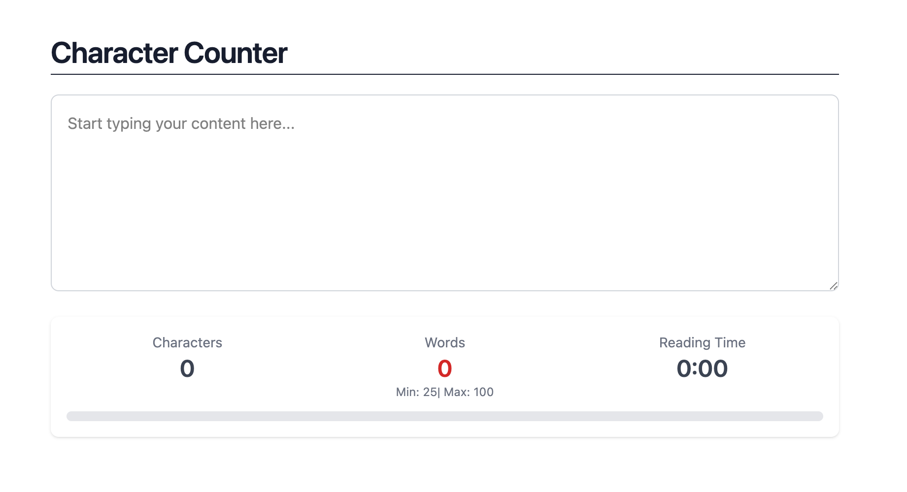
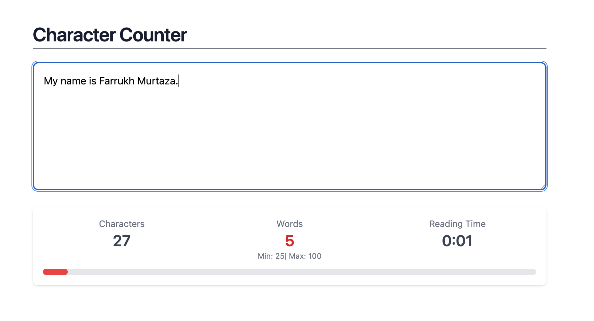
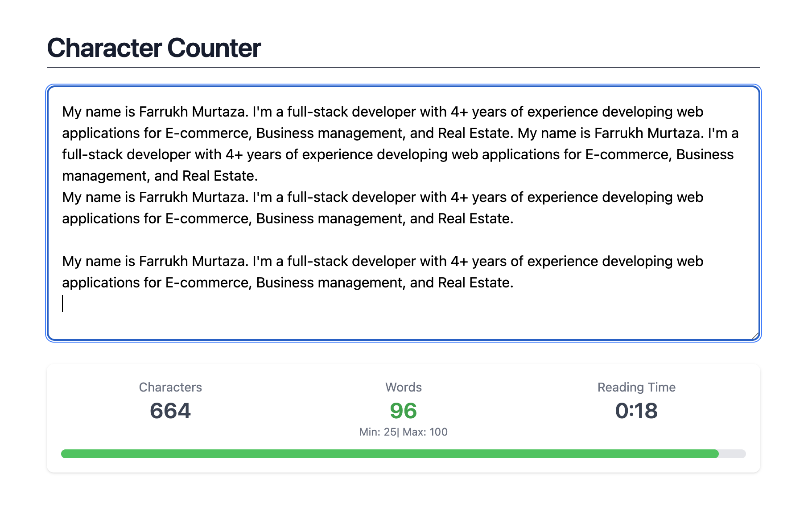
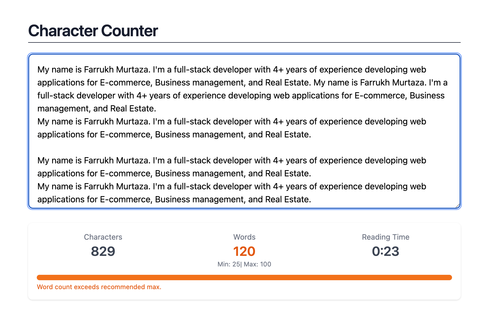

# Character Counter

A real-time character, word, and reading-time counter built with React and TypeScript. Users type into a textarea and instantly see live statistics along with visual feedback on whether their word count falls within a target range (25–100 words).

## Features

- **Live character count** as you type
- **Live word count** with color-coded feedback:
  - 🔴 Red — below the minimum (25 words)
  - 🟢 Green — within the target range (25–100 words)
  - 🟠 Orange — exceeds the recommended maximum (100 words), with an inline warning message
- **Estimated reading time**, calculated using an average reading speed (words per minute)
- **Progress bar** showing word count progress toward the goal range, clamped so it never visually overflows its container
- Fully **controlled** text input backed by React state
- Component-based architecture with typed props and callback-driven communication

### Word Count States

| State                  | Description                                                                        |
| ---------------------- | ---------------------------------------------------------------------------------- |
| **Empty state**        | 0 characters, 0 words, 0:00 reading time                                           |
| **Below minimum**      | Word count under 25, shown in red with a barely filled progress bar                |
| **Within valid range** | Word count between 25–100, shown in green with the progress bar filled accordingly |
| **Exceeds limit**      | Word count over 100, shown in orange with an inline warning message                |

#### Screenshots
| Empty State                                                                                                                                                                     | Below Minimum                                                                                                                                               |
| ------------------------------------------------------------------------------------------------------------------------------------------------------------------------------- | ----------------------------------------------------------------------------------------------------------------------------------------------------------- |
| 0 characters, 0 words, 0:00 reading time<br><br>                                                  | Word count under 25 shown in red, with a barely filled progress bar<br><br>   |
| **Within Valid Range**                                                                                                                                                          | **Exceeds Limit**                                                                                                                                           |
| Word count between 25–100 shown in green, with the progress bar filled accordingly<br><br> | Word count over 100 shown in orange, with an inline warning message<br><br> |


## Project Structure

```
src/
├── App.tsx                     # Root component; owns text + stats state
└── components/
    ├── TextInput.tsx           # Controlled textarea, emits onChange events
    ├── StatsDisplay.tsx        # Renders stat cards + progress bar
    └── CharacterCounter.tsx    # Reusable stat card (label, value, optional children)
```

### Component Responsibilities

- **`App`** — holds the source-of-truth state (`text`, `charCount`, `wordCount`, `readingTime`) and the single `handleTextArea` handler that recalculates all derived stats on every keystroke.
- **`TextInput`** — a controlled `<textarea>` that receives `value` and an `onTextAreaChange` callback prop; it has no internal state of its own.
- **`StatsDisplay`** — receives the calculated stats as props, derives UI-only state (colors, progress percentage, min/max flags), and renders the stat cards plus the progress bar.
- **`CharacterCounter`** — a small, reusable presentational component for a single stat (label + value + optional children, such as the "Min: 25 | Max: 100" hint).

## Statistics Logic

```ts
const chCount = value.length;
const wdCount = value === '' ? 0 : value.split(/\s+/).filter(Boolean).length;

const totalSeconds = Math.ceil((wdCount / WPM) * 60);
const minutes = Math.floor(totalSeconds / 60);
const seconds = totalSeconds % 60;
const rdTime = `${minutes}:${seconds.toString().padStart(2, '0')}`;
```

- **Characters**: raw `value.length` (whitespace included).
- **Words**: split on any run of whitespace (`/\s+/`) and filter out empty strings, so leading/trailing/multiple spaces don't inflate the count. An empty string is explicitly mapped to `0` words.
- **Reading time**: word count divided by words-per-minute (WPM), converted to seconds, then formatted as `m:ss`.

## Getting Started

```bash
npm install
npm run dev
```

## Reflection Questions

### How did you handle state updates when the text changed?

All state lives in `App` and is treated as a single source of truth. The `onChange` handler on the textarea (`handleTextArea`) fires on every keystroke and does two things in one pass: it updates the raw `text` state so the textarea remains a fully controlled input, and it derives `charCount`, `wordCount`, and `readingTime` from that same input value and pushes them into their own state variables. Keeping the raw text and the derived stats as separate state values (rather than recalculating stats on every render from a single source) made it straightforward to pass typed, purpose-specific props down to child components instead of passing the whole string everywhere.

### What considerations did you make when calculating reading time?

The main considerations were correctness of the underlying word count and the output format. Reading time is only as accurate as the word count it's based on, so the word-splitting logic needed to handle multiple spaces, tabs, and newlines correctly (using a `/\s+/` regex with `.filter(Boolean)` rather than a naive `split(" ")`, which breaks on consecutive spaces and empty strings). For the time itself, I converted words-per-minute into total seconds rather than working in fractional minutes, since rounding fractional minutes directly produced misleading values (e.g., always displaying whole minutes like "1.00"). Converting to seconds first and then deriving `minutes:seconds` gives a more precise and readable result, especially for short pieces of text where the reading time is under a minute.

### How did you ensure the UI remained responsive during rapid text input?

The statistics calculations are all simple, synchronous string operations (`.length`, `.split`, basic arithmetic) with no loops over large data structures or expensive work, so they run well within a single frame even on longer text. Making `TextInput` a small, isolated component with no local state of its own (aside from receiving `value`/`onChange` as props) also keeps re-renders predictable — only the state that actually changes on each keystroke triggers a re-render of the components that depend on it, rather than re-rendering unrelated parts of the tree. Using derived UI state (colors, progress percentage) computed inline in `StatsDisplay` rather than storing them separately avoided extra `setState` calls per keystroke, further reducing the number of state updates per render cycle.

### What challenges did you face when implementing the statistics calculations?

The trickiest issues were edge cases around empty and whitespace-only input. An early version used `value.split(" ")`, which returns `[""]` (length 1) for an empty string, incorrectly reporting one word instead of zero — and it also overcounted words when there were multiple consecutive spaces or newlines between them. This was fixed by explicitly checking for an empty trimmed string and switching to a whitespace regex split combined with filtering out empty strings. A related challenge was formatting reading time in a way that matched the initial `'0:00'` state — the first implementation computed whole minutes and applied `.toFixed(2)` to that integer, which produced a value like `"1.00"` instead of a proper `minutes:seconds` string. The last challenge was making the word-count progress bar visually honest: an unclamped `width` percentage could exceed 100% once the word count passed the goal, causing the bar to overflow its rounded container, so the width had to be clamped with `Math.min(...)` and the container given `overflow-hidden`.